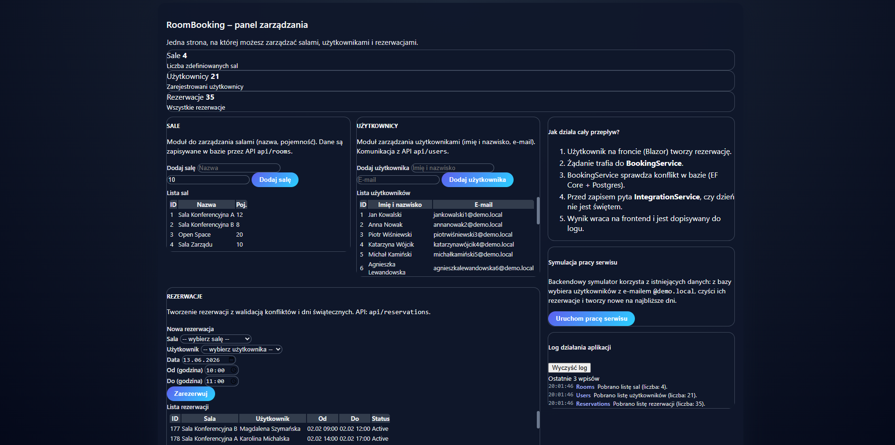
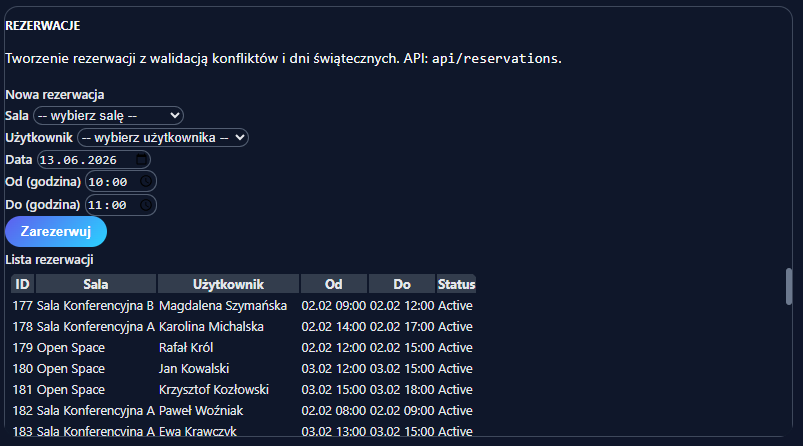
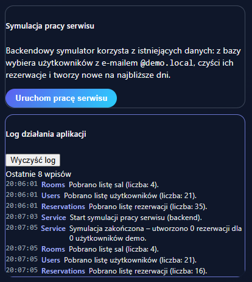

# RoomBooking

Conference room reservation platform built using service-oriented architecture.

## Overview

RoomBooking is a business application responsible for managing conference room reservations.

The project demonstrates service separation, API communication and business validation.

## Features

- Room management
- Reservation scheduling
- Conflict validation
- Availability checking
- Business workflows

## Architecture

### Services

- BookingService
- IntegrationService

### Infrastructure

- PostgreSQL
- Docker
- REST API

## Technologies

- ASP.NET Core
- C#
- PostgreSQL
- Docker
- Entity Framework Core

## Screenshots

### Reservation Dashboard

### Room Calendar

### Room Service Symulation 

## Learning Goals

- Service-oriented architecture
- API design
- Business process modeling
- Docker containers
- Data persistence

## Future Improvements

- Authentication
- Notifications
- Event-driven communication
- Message broker integration

## Author

Michał Łuczak